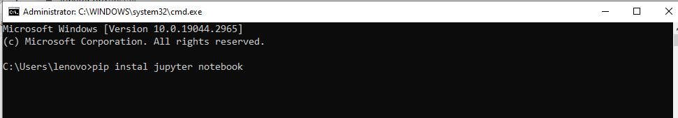
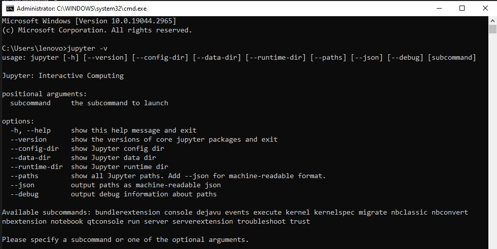

# Install_Jupyter
Welcome my to tutorial

## Ini adalah spoiler bagaimana cara menginstall jupyter notebook di leptop kalian


<p align="center">
 
</p>
<p align="center">
<a href="https://github.com/akmalabdilah"></a>
<p align="center">

<p align="center">
<a href="https://github.com/akmalabdilah/Install_Jupyter">Requirements</a> •
<a href="https://github.com/akmalabdilah/Install_Jupyter">Informasi</a> •
<a href="https://github.com/akmalabdilah/Install_Jupyter">Tutorial</a>
</p>
</div>

# Requirements
- [Jupyter Notebook](https://git-scm.com/download)

# Informasi Jupyter Notebook
Apa itu Jupyter Notebook?
<p>
Jupyter Notebook adalah sebuah aplikasi web open-source yang digunakan untuk membuat dan berbagi dokumen yang menggabungkan kode program, visualisasi data, narasi teks, serta elemen-elemen interaktif lainnya. Jupyter Notebook sering digunakan dalam pengembangan dan analisis data, serta dalam pembelajaran dan komunikasi ilmiah.

Dalam sebuah Jupyter Notebook, pengguna dapat membuat dan menjalankan kode program dalam berbagai bahasa pemrograman seperti Python, R, Julia, dan lainnya. Setiap blok kode dapat dieksekusi secara terpisah, yang memungkinkan pengguna untuk mengevaluasi dan memodifikasi kode secara iteratif. Output dari blok kode, seperti hasil komputasi atau visualisasi, dapat ditampilkan secara langsung dalam notebook.

Selain kode, Jupyter Notebook juga mendukung penggunaan teks format Markdown, yang memungkinkan pengguna untuk menulis narasi, menjelaskan konsep, menambahkan gambar, serta menyajikan hasil analisis dan interpretasi data dengan lebih jelas. Ini membuat Jupyter Notebook sangat berguna dalam pembuatan laporan, tutorial, dan presentasi interaktif.

Salah satu fitur utama dari Jupyter Notebook adalah kemampuannya untuk menyimpan dan berbagi notebook dalam format yang dapat dibuka di browser web. Hal ini memungkinkan pengguna untuk berbagi kode, visualisasi, dan penjelasan dengan mudah kepada orang lain melalui repositori online atau layanan berbagi notebook seperti GitHub atau Jupyter Notebook Viewer.

Jupyter Notebook telah menjadi salah satu alat yang populer di kalangan ilmuwan data, peneliti, dan pengembang perangkat lunak karena kemampuannya yang fleksibel dan interaktif.
</p>

# Tutorial
- Pada saat pertama kali menggunakan Jupyter Notebook, perlu dilakukan PENCARIAN DI CROME 
. Jalankan perintah berikut:

```chrome
> https://jupyter.org/install
```


- Setelah itu jalankan perintah ikuti langkah-langkah yang di berikan di situs resmi jupyter notebook tersebut.

- 1. Buka CMD di leptop kalian dan ketik.



```bash
pip install jupyter notebook

```

- 2. Setelah itu jika download sudah selesai kita cek jupyter sudah terpasang apa belum dengan mengetik di cmd.



```bash
 jupyter notebook -v

```

- Oke mungkin segitu saja tutorial dari saya mengenai cara menginsall jupyter notebook nanti jika saya lagi gabut lagi saya akan memberikan tutorial kedua cara menggunakan jupyter notebook.

- Selesai


<div>
<h2 align="center">Thanks For Reading!!!</h2>
<div align="center">
